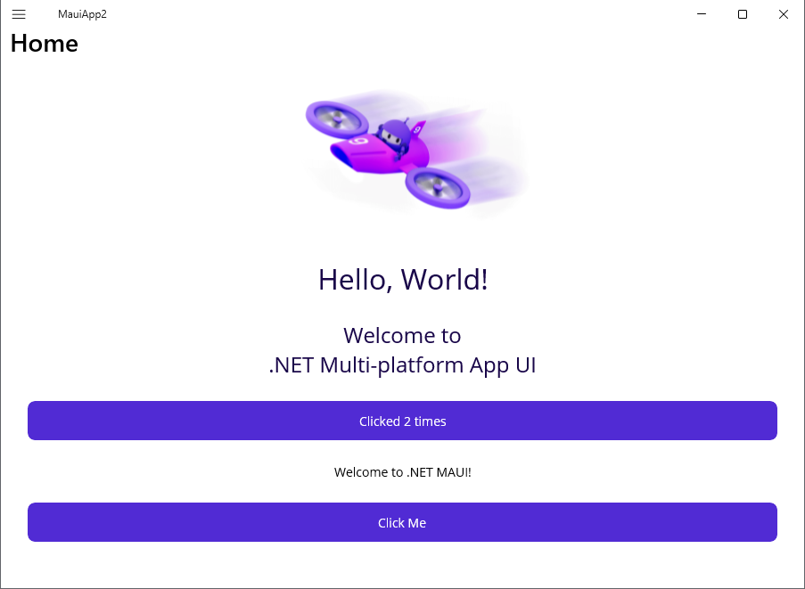
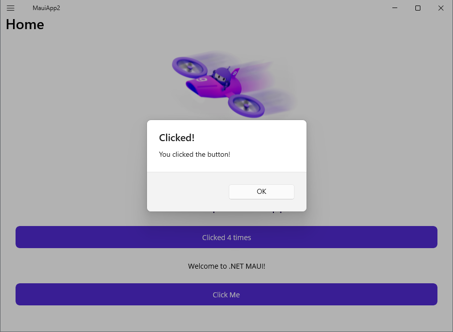
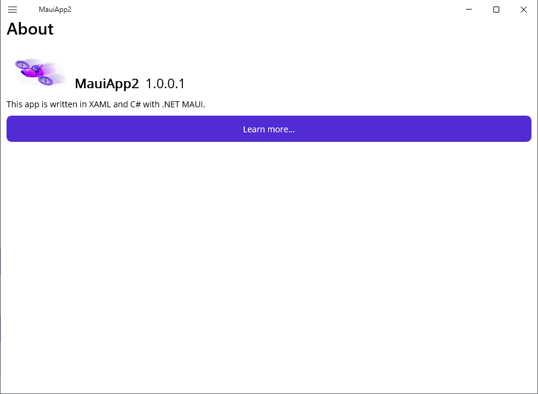


# Introduction

This repo is a of .Net Maui `Todo-list` tutorial.

- This tutorial demonstrate key concepts of `.Net Maui` application:
  - XAML UI design and code behind.
  - MVVM architecture pattern in Maui app with model, view and view model.
  - Event handling
  - Navigation between screens
  - File access ...

Below is the list of screens from the app.

Home screen

Popup and Event handling

About screen

Add a new Note

Notes list

